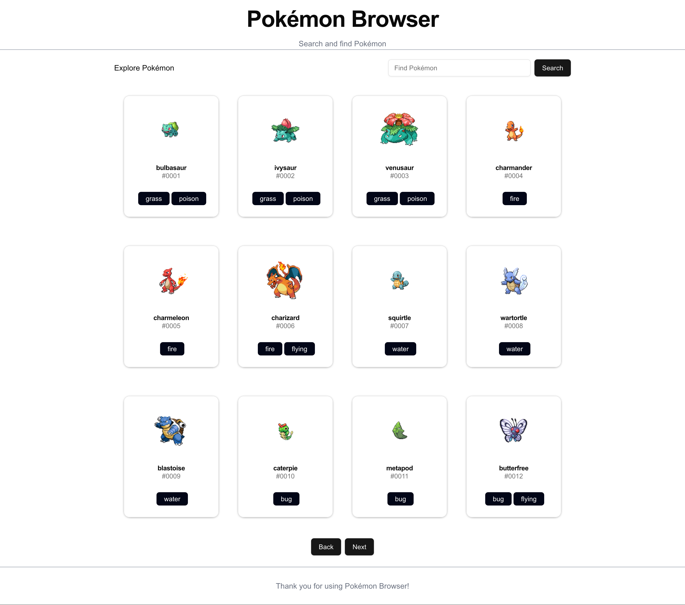
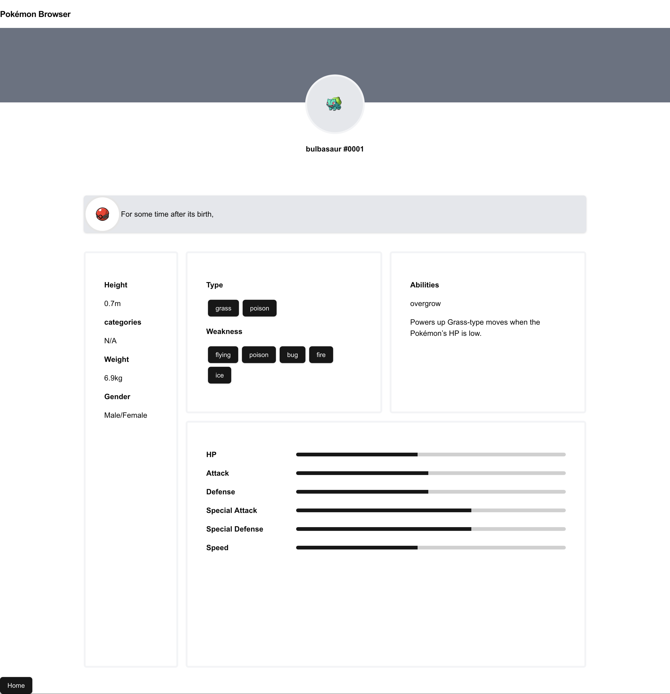

This is a [Next.js](https://nextjs.org) project bootstrapped with [`create-next-app`](https://nextjs.org/docs/app/api-reference/cli/create-next-app). Using [TypeScript](https://www.typescriptlang.org/), [ShardCN/UI](https://ui.shadcn.com/), [Tailwind](https://tailwindcss.com/) and [PokeAPI.co](https://PokeAPI.co)

## Getting Started

1. Clone or download the project 
1. Open a terminal and CD into the project
1. To install all the dependency run:
```sh
npm install
```
1. Then launch the development server:

```bash
npm run dev
# or
yarn dev
# or
pnpm dev
# or
bun dev
```

Open [http://localhost:3000](http://localhost:3000) with your browser to see the result.

# Useful Links
- [Tailwind Cheat Sheet](https://www.creative-tim.com/twcomponents/cheatsheet)
- [TypeScript](https://www.typescriptlang.org/)
- [ShardCN/UI](https://ui.shadcn.com/)
- [Tailwind](https://tailwindcss.com/)
- [LearnXinY](https://learnxinyminutes.com/typescript/)
- [PokeAPI.co](https://PokeAPI.co)

# Currently implemented
- Homepage population
- Next and Previous Buttons
- Detailed Stats page populated with information from [PokeAPI.co](https://PokeAPI.co)
    - **NOTE:** had issues finding where Gender, Categories and Description was located in the JSON
- Search

# Screenshots






